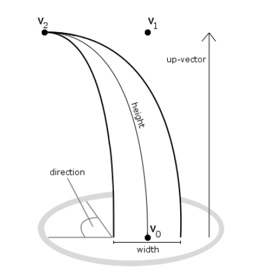
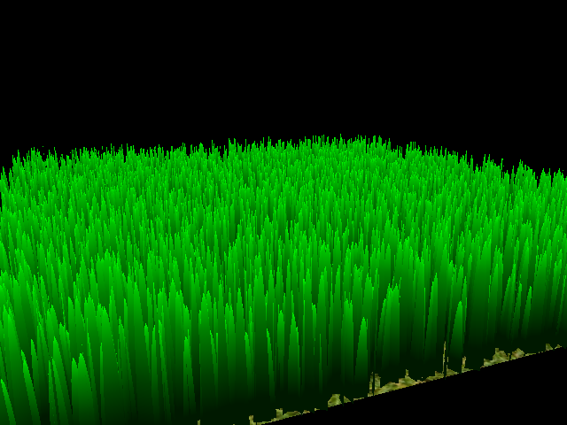
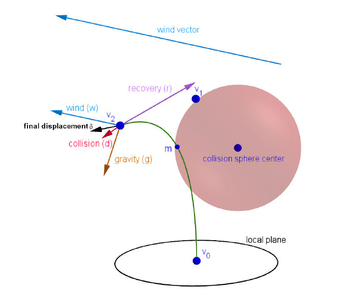
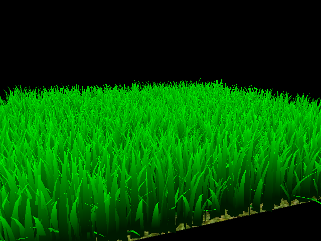
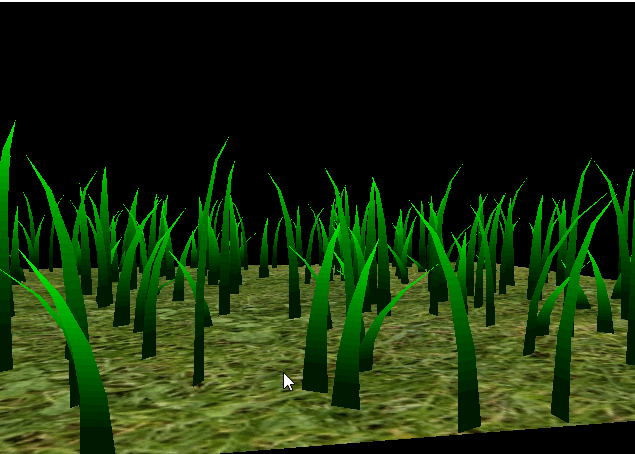
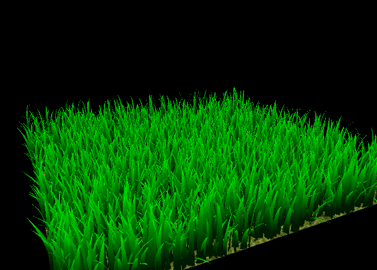
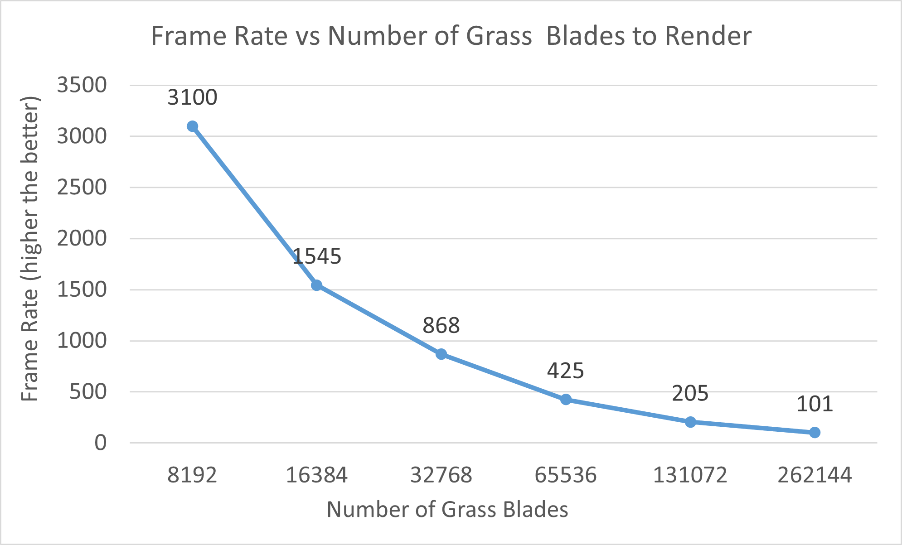
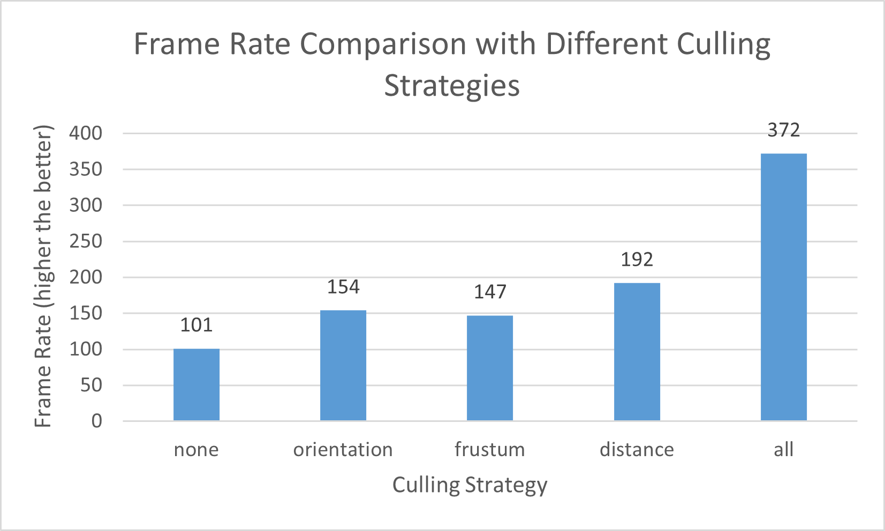

Vulkan Grass Rendering
==================================

**University of Pennsylvania, CIS 565: GPU Programming and Architecture, Project 5**

- Zhanbo Lin
    - [LinkedIn](https://www.linkedin.com/in/zhanbo-lin)
- Tested on: Windows 10, i5-10400F @ 2.90GHz 48GB, RTX-3080 10GB
- GPU Compute Capability: 8.6

## Project Description

This project implements the paper "[Responsive Real-Time Grass Rendering for General 3D Scenes](https://www.cg.tuwien.ac.at/research/publications/2017/JAHRMANN-2017-RRTG/JAHRMANN-2017-RRTG-draft.pdf)", which presents an efficient, physically based method for simulating and rendering large-scale grass fields in real time.

## Technical Details

### 1. Blade Geometry
In this implementation, each grass blade is represented by __3 Bézier control points__ and __tessellated in the shader__ to generate the actual geometry for rendering (shown below). 

The properties of each blade, such as length and orientation, are randomly generated offline to create a more natual look across the grass field.

*Figure 1. Each blade is defined by three Bézier control points forming a curved surface (image from the paper).*

 

*Figure 2. The rendering of blades when no external force is applied*

 

### 2. Physics Model

In this implementation, the grass blades’ dynamics are influenced by three simulated external forces:
 - __Gravity__
 - __Recovery__
 - __Wind__

The original paper also includes a collision response simulation, which is not implemented in this project.

The physics simulation for each blade is executed entirely on the GPU using a compute shader, enabling large-scale, real-time grass dynamics.

*Figure 3. The external forces interaction model (image from the paper)*

 

#### Gravity and Recovery Force
The gravity and recovery forces together contribute to the grass blades’ natural bending motion. 

The gravity force acts in the `−Y` direction with a gravitational acceleration constant of `9.8`, pulling the blade downward. The recovery force is computed based on a stiffness coefficient and the displacement between the blade’s tip and its original upright position, so that the recovery force will increase proportionally with the bending angle.

*Figure 4. The gravity and recovery force reaches a balance point*

 

#### Wind Field
The wind field introduces additional motion that makes the grass blades appear more dynamic.

It is defined by a direction vector and a speed function, where the speed is determined by evaluating a procedural 2D value noise function. The noise function is adapted from [Inigo Quilez’s Shadertoy example](https://www.shadertoy.com/view/Msf3WH).

To simulate continuous wind movement, the sample position of the noise is shifted over time along the opposite of the wind direction. In addition, the spatial frequency of the noise is adjusted — higher along the wind direction — to produce a more natural, wave-like motion across the grass field.

*Figure 5. Dynamic grass motion under varying wind fields.*

*Figure 6. Visualization of wind speed*

 

### 3. Culling
After computing the physics interactions, a series of culling tests are applied to improve rendering efficiency. The surviving (visible) blades are stored in a new buffer to ensure better data locality and minimize memory access cost during rendering.

Three types of culling are implemented:
- Orientation Test
- View-Frustum Test
- Distance Test

 

#### Orientation Test
The orientation test removes blades that are nearly parallel to the camera’s view direction for they contribute little to the final image. The view direction is computed from the blade root position to the camera position, and compared with the blade’s edge direction. If the dot product between the two vectors is above certain threshold (we use 0.9), the blade is culled from rendering.

*Figure 6. Culling blades that are nearly parallel to the view direction*

#### View-frustum Test
The frustum test removes blades that are outside of the frustum to save save computation and rendering cost. In order to do it efficiently, we only check 3 key points of each blade: the root, the tip, and the midpoint. Since each blade is modeled as a Bézier curve, we can easily calculate the mid point using De Casteljau’s algortithm: `0.25 * v0 + 0.5 * v1 + 0.25 * v3` where v1 v2 v3 are the control points of the grass blade.

The frustum culling is hard to visualize since the culled blades are invisible anyway. But we can compare the frame rate before and after the culling. As shown below, when the camera moves closer and fewer blades remain visible, the frame rate nearly doubles after applying frustum culling.

   Before     |   After
:-------------------------:|:-------------------------:
  | 

 

#### Distance Test
The distance test removes grass blades that are too far from the camera to contribute visually, further improving rendering efficiency.

For each blade, the distance from the camera to the blade’s root position is calculated.
If this distance exceeds a predefined culling radius, the blade is discarded.

 

## Performance Analysis

### Scalability
This test is done wihout any culling applied. As the number of grass blades increases, the frame rate decreases, as shown in the chart below.
This trend is intuitive since both the compute shader physics calculations and the tessellation process scale proportionally with the number of blades, increasing the overall GPU workload. 

However, despite the increase in workload, the system maintains interactive frame rates and shows it's potential of  handling large-scale grass fields efficiently.

 

### Culling Comparison
This test is done with 262144 (2^18) grass blades in the scene. 

The performance results are highly dependent on parameter settings and the specific scene configuration.
Therefore, the following conclusions apply only to this particular scene and camera viewpoint.
Different environments, blade densities, or viewing angles may lead to variations in culling effectiveness and overall frame rate.

In combination of all three tests, the frame rate increased from 101 to 372 FPS. The distance culling provides the largest single improvement, followed by the orientation test, and lastly the frustum test. 

